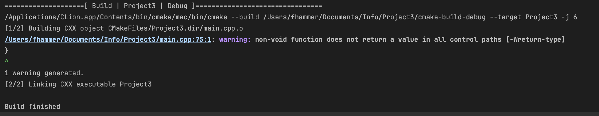
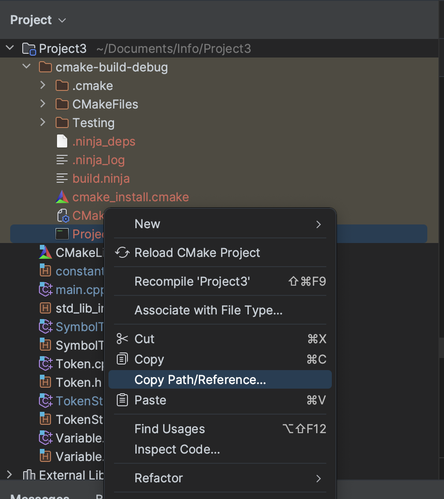
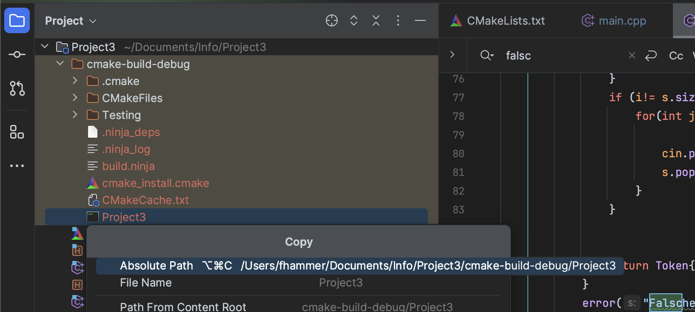
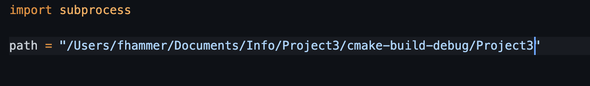
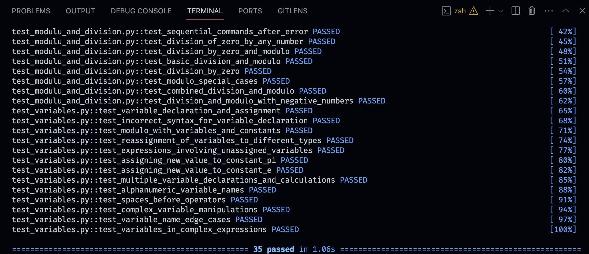

# Ein paar mehr Tests

Hier gibt es ein paar weitere inoffizielle Tests für das Projekt3 Taschenrechner, geschrieben in Python.
Zur Vereinfachung wird nur `cout` abgehört, also nicht `cerr`. Daher müsstet ihr alle Ausgaben von Fehlern zu `cout` ändern.

Weiterhin benutzen wir "Modulo ist nur auf ganzen Zahlen erlaubt." und nicht "Modulo ist nur für ganzen Zahlen erlaubt." (die Artemis-Seite ist hier inkonsistent).

Wichtig ist, dass diese Tests absolut inoffiziell sind und größtenteils von ChatGPT verfasst wurden. Die Lösungen könnten auf jeden Fall falsch sein.

## Installieren

1. Eine Python-Bibliothek, die das Testen einfach macht: `pip install pytest`

2. Um das C++-Programm über Python aufrufen zu können, müssen wir es kompilieren (oder auch builden).
   Dafür klicken wir einfach auf den Hammer in CLion links neben "Run".
   

   Wenn alles klappt, sollte am Ende die Nachricht `build finished` im Terminal stehen, so wie hier:
   

3. Jetzt müssen wir nur noch den Pfad unseres Programms kopieren.

   Das Programm findet ihr unter `cmake-build-debug/EuerProjectName/`. Dann könnt ihr wie hier den absoluten Pfad kopieren.
   
   

   Nun müsst ihr nur noch den Pfad in `calculator.py` hier im Ordner einfügen.
   

## Testen

Gebt im Terminal in diesem Ordner `pytest -vv .` ein, um die Tests auszuführen. Ihr erhaltet dann die Ergebnisse wie hier oder die Fehlermeldungen.

Wenn alles klappt, sollte eure Konsole so aussehen:

